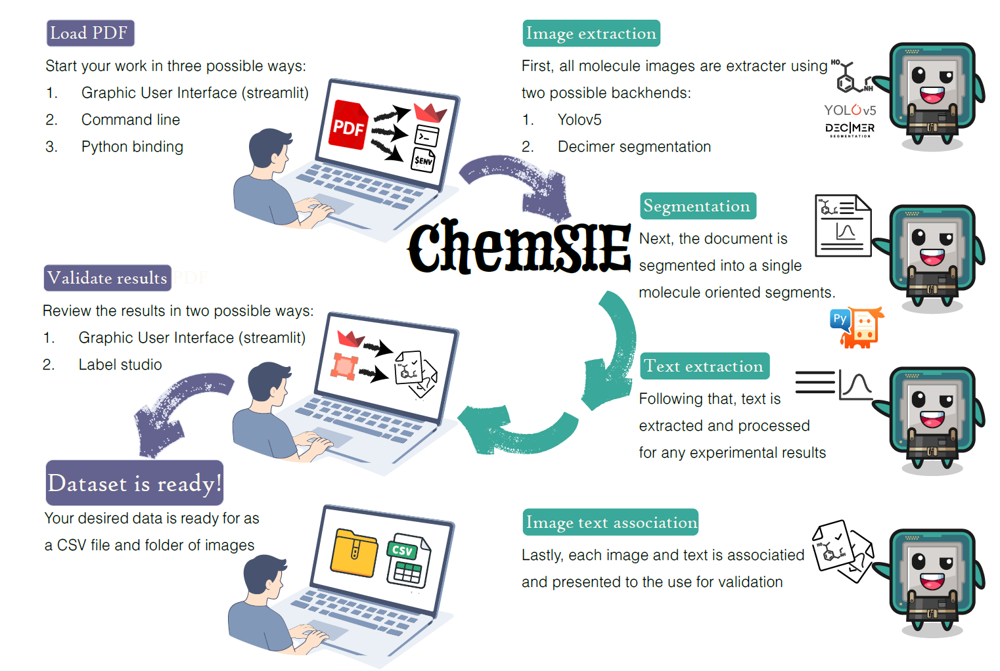

# ChemSIE - From document-based experimental records to machine-actionable experimental data



**ChemSIE** is a user-guided, automated pipeline for converting **PDF-based experimental records** (e.g., Supplementary Information, theses, internal reports) into **molecule-resolved, machine-actionable experimental datasets**.

Many experimentally relevant observables in chemistry are reported in document-based formats where **molecular depictions and characterization measurements are presented together**, yet remain difficult to reuse in automated workflows. ChemSIE addresses this gap by combining layout-aware image detection, molecule-centric document segmentation, and modality-specific text parsing, with optional user validation.

---

## Paper

This repository accompanies the manuscript:

> *ChemSIE: From Document Based Records to Machine Actionable Experimental Data*  
> Itamar Wallwater, Yonatan Harnik, Ari Pakman, Anat Milo  
> (preprint)


## How it works

ChemSIE is designed around recurring structural patterns in SI documents and theses:

1. **Select PDFs** via GUI, CLI, or Python API.
2. **Automated extraction and association**:
   - Detect molecular depictions using **YOLOv5** or **DECIMER Segmentation**.
   - Preserve spatial metadata for each detected depiction.
   - Segment the document into molecule-centric regions using reporting heuristics.
   - Parse characterization text within each molecule segment.
3. **Validation and curation (optional but recommended)**:
   - Review/edit extracted text and associations in a **Streamlit GUI**.
   - Inspect and correct associations in **Label Studio** while viewing the original PDF region.
4. **Export** a structured database (CSV + linked images) suitable for downstream analysis and FAIR-aligned reuse.

---

## Table of contents

- [Quick start (non‑coders)](#quick-start-noncoders)
- [Installation](#installation)
- [Run ChemSIE](#run-chemsie)
  - [Option A: GUI (Streamlit)](#option-a-gui-streamlit)
  - [Option B: Command line (CLI)](#option-b-command-line-cli)
  - [Option C: Python API](#option-c-python-api)
- [Human validation](#human-validation)
  - [Label Studio setup](#label-studio-setup)
- [Benchmark data](#benchmark-data)
- [Outputs](#outputs)
- [Troubleshooting](#troubleshooting)
- [Citation](#citation)
- [Acknowledgements](#acknowledgements-and-upstream-projects)
- [Support](#support)

---

## Quick start (GUI)

If you prefer a point-and-click workflow, use the Streamlit GUI.

```bash
conda activate pdf_extractor
python -m streamlit run build/Streamlit_apps/streamlit_extraction_GUI.py
```

---

## Installation

### 1) Clone

```bash
git clone https://github.com/itarog/PDF_extractor.git
cd PDF_extractor
```

### 2) Create and activate a Conda environment (recommended)

```bash
conda create -n pdf_extractor python=3.10
conda activate pdf_extractor
```

### 3) Install

```bash
python -m pip install .
```

---

## Run ChemSIE

ChemSIE supports three entry points that invoke the same backend pipeline.

### Option A: GUI (Streamlit)

```bash
conda activate pdf_extractor
python -m streamlit run build/Streamlit_apps/streamlit_extraction_GUI.py
```

### Option B: Command line (CLI)

If `main.py` lives at repository root:

```bash
python main.py --input demo_data --output results --pics --backend yode --visualize
```

If `main.py` lives under `build/` in your checkout:

```bash
python build/main.py --input demo_data --output results --pics --backend yode --visualize
```

Common modes:

- Text + molecule images (YOLOv5/YoDe backend):
  ```bash
  python main.py --input demo_data --output results --pics --backend yode
  ```

- Text + molecule images (DECIMER segmentation backend):
  ```bash
  python main.py --input demo_data --output results --pics --backend decimer
  ```

- Text only:
  ```bash
  python main.py --input demo_data --output results
  ```

- Visualize an existing database:
  ```bash
  python main.py --output results --visualize-only
  ```

### Option C: Python API

```python
from build.streamlit_wrappers import process_pdf_dir_end_to_end

pdf_dir = "./demo_data"
database_name = "my_database"

cmd_process = process_pdf_dir_end_to_end(
    pdf_dir,
    verbose=True,
    backend="yode",  # or "decimer"
    database_name=database_name,
    graph_sketch=False,
)
```

---

## Outputs

ChemSIE produces outputs intended to be inspectable and reusable:

- **One `.pkl` per PDF** containing detected molecule segments, bounding boxes, extracted text blocks, and positional metadata.
- **Database export** (CSV + linked images directory): one row per molecule-resolved record.

Example access pattern:

```python
from build.storeage_obj import load_pickle_by_filename

result = load_pickle_by_filename("results/example.pkl")
for segment in result.molecule_segments:
    print(segment.molecule_name)
```

---

## Human validation and correction

ChemSIE emphasizes transparency and user-guided validation.

- **Streamlit GUI**: unified interface for running extraction and reviewing/editing parsed experimental text.
- **Label Studio**: cross-check associations by juxtaposing the processed record with the original PDF segment.

Send PKLs to Label Studio:

```bash
python send_to_label_studio.py --pkl-folder results --pdf-dir demo_data/Exdata_1 --api-key <api_key>
```

Update PKLs from Label Studio annotations:

```bash
python update_from_label_studio.py --pkl-folder results --pdf-dir demo_data/Exdata_1 --api-key <api_key>
```

### Label Studio local file serving

Windows (cmd):

```cmd
set LOCAL_FILES_SERVING_ENABLED=true
set LOCAL_FILES_DOCUMENT_ROOT=Z:\
label-studio
```

macOS/Linux (bash/zsh):

```bash
export LOCAL_FILES_SERVING_ENABLED=true
export LOCAL_FILES_DOCUMENT_ROOT=/path/to/root
label-studio
```

Or use the helper:

```bash
python start_label_studio.py
```

---

## Troubleshooting

### Streamlit runs in the wrong environment

If `import DECIMER` works in `python` but fails in Streamlit, you are almost certainly running Streamlit from a different interpreter. Use:

```bash
conda activate pdf_extractor
python -m streamlit run build/Streamlit_apps/streamlit_extraction_GUI.py
```

### "No PDF files found"

- Ensure the input folder contains `.pdf` files.
- Double-check the path passed to `--input`.

---

## Citation

If you use ChemSIE in academic work, please cite the associated paper (details to be added):

```bibtex
@article{wallwater_chemsie_2025,
  title   = {ChemSIE: From Document Based Records to Machine Actionable Experimental Data},
  author  = {Wallwater, Itamar and Harnik, Yonatan and Pakman, Ari and Milo, Anat},
  year    = {2025},
}
```

---

## Acknowledgements and upstream projects

ChemSIE builds on many open-source projects. If you use this repository, please also consider citing and acknowledging the upstream tools below.

Core extraction and document processing:

- YOLOv5 (Ultralytics): https://github.com/ultralytics/yolov5
- DECIMER Transformer: https://github.com/Kohulan/DECIMER-Image_Transformer
- DECIMER-Segmentation: https://github.com/Kohulan/DECIMER-Segmentation
- OPSIN (name-to-structure): https://github.com/dan2097/opsin
- PyMuPDF: https://github.com/pymupdf/PyMuPDF
- pypdf: https://github.com/py-pdf/pypdf
- pdf2image: https://github.com/Belval/pdf2image
- Poppler: https://github.com/oschwartz10612/poppler-windows

Human-in-the-loop tools:

- Streamlit: https://github.com/streamlit/streamlit
- Label Studio: https://github.com/HumanSignal/label-studio

---

## Support

Please open a GitHub Issue with:

- OS (Windows/macOS/Linux)
- Python version (`python --version`)
- exact command you ran
- a minimal PDF example if possible
