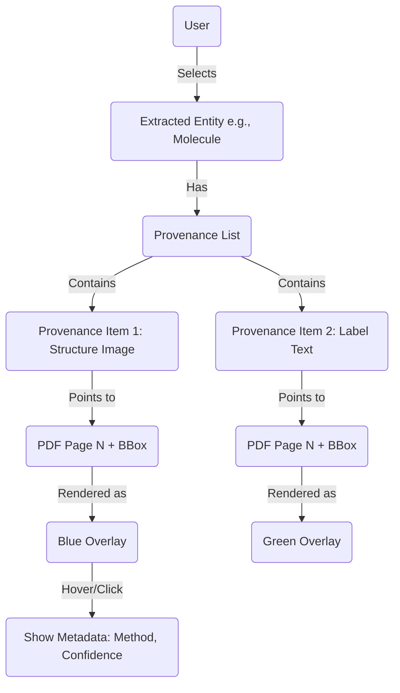

# Visual Provenance Design

## 1. Goal
To enable a human expert to rapidly validate or reject ChemSIE extractions by inspecting the *evidence* behind every claim.

## 2. Conceptual Data Flow

## 3. The "Inspector" Interface Design

The proposed validation UI (to be implemented in Streamlit) consists of three pane interactions:

### A. The Graph Pane (Right)
Displays the extracted `ExtractedData` as a structured list or graph.
*   **Molecules:** Cards showing SMILES + ID.
*   **Spectra:** Lists linked to molecules.
*   **Interaction:** Clicking a card activates "Inspection Mode" for that entity.

### B. The Document Pane (Left)
Displays the rendered PDF pages.
*   **Overlay Layer:** SVG/Canvas layer drawn over the PDF.
*   **Interaction:**
    *   **Passive:** Shows all detected regions (faintly).
    *   **Active:** When an Entity is selected, *only* its provenance regions are highlighted.
    *   **Color Coding:**
        *   **Cyan:** Structure Image.
        *   **Yellow:** Text Label/Caption.
        *   **Magenta:** Spectral Data Text.

### C. The Evidence Detail (Modal/Sidebar)
When an entity is selected, this pane breaks down *why* it exists.
*   **Structure Confidence:** "98% (DECIMER)"
*   **Label Link:** "Found '1a' in caption (dist: 10px)"
*   **Raw Snippet:** Shows the cropped image or text snippet extracted.

## 4. Required Data Relationships

To support this, the schema needs to enforce:

1.  **Unique Stable IDs:** Every `Provenance` item needs to be addressable.
2.  **Role Tagging:** We need to know if a bbox is the *source* of the structure or just a *reference* to it.

## 5. Implementation Strategy (Future)

1.  **Frontend:** Streamlit with `streamlit-pdf-viewer` or custom iframe for bbox rendering.
2.  **Backend:** `chemsie` serves the JSON with coordinates.
3.  **Coordination:** Normalized coordinates (0-1000 or 0-1 float) are essential to handle different rendering DPIs.
